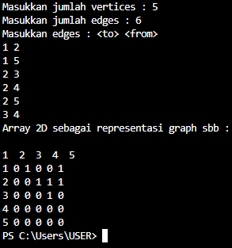

# LAPORAN JOBSHEET 14 PRAKTIKUM ALGORITMA DAN STRUKTUR DATA

Dibuat oleh : 

Bagus Dwi Putranto 

1F D4 Teknik Informatika 

2141720079 

## 2.1 Implementasi Graph menggunakan Linked List
### 2.1.1 Tahapan Percobaan
1. Buatlah class Node, dan class Linked Lists sesuai dengan praktikum Double Linked Lists. 

 
2. Tambahkan class Graph yang akan menyimpan method-method dalam graph dan juga method main(). 

 
3. Di dalam class Graph, tambahkan atribut vertex bertipe integer dan list[] bertipe LinkedList. 

4. Tambahkan konstruktor default untuk menginisialisasi variabel vertex dan menambahkan perulangan untuk jumlah vertex sesuai dengan jumlah length array yang telah ditentukan. 

5. Tambahkan method addEdge(). Jika yang akan dibuat adalah graph berarah, maka yang dijalankan hanya baris pertama saja. Jika graph tidak berarah yang dijalankan semua baris pada method addEdge(). 

6. Tambahkan method degree() untuk menampilkan jumlah derajat lintasan pada suatu vertex. Di dalam metode ini juga dibedakan manakah statement yang digunakan untuk graph berarah atau graph tidak berarah. Eksekusi hanya sesuai kebutuhan saja. 

7. Tambahkan method removeEdge(). Method ini akan menghapus lintasan ada suatu graph. Oleh karena itu, dibutuhkan 2 parameter untuk menghapus lintasan yaitu source dan destination. 

8. Tambahkan method removeAllEdges() untuk menghapus semua vertex yang ada di dalam graph. 

9. Tambahkan method printGraph() untuk mencatak graph ter-update. 

10. Compile dan jalankan method main() dalam class Graph untuk menambahkan beberapa edge pada graph, kemudian tampilkan. Setelah itu keluarkan hasilnya menggunakan pemanggilan method main(). Keterangan: degree harus disesuaikan dengan jenis graph yang telah dibuat (directed/undirected). 

11. Amati hasil running tersebut.
12. Tambahkan pemanggilan method removeEdge() sesuai potongan code di bawah ini pada method main(). Kemudian tampilkan graph tersebut. 

13. Amati hasil running tersebut.
14. Uji coba penghapusan lintasan yang lain! Amati hasilnya!

### 2.1.2 Verifikasi Hasil Percobaan

### 2.1.3 Pertanyaan Percobaan
1. Sebutkan beberapa jenis (minimal 3) algoritma yang menggunakan dasar Graph, dan apakah kegunaan algoritma - algoritma tersebut?
> : 1. addEdge() = berfungsi untuk menambahkan edge, 2. removeEdge() = berfungsi untuk menghapus edge tertentu, 3. removeAllEdge() = berfungsi untuk menghapus semua edge
2. Pada class Graph terdapat array bertipe LinkedList, yaitu LinkedList list[]. Apakah tujuan pembuatan variabel tersebut ?
> : berfungsi untuk membuat array bernama list dengan atribut class LinkedList.
3. Apakah alasan pemanggilan method addFirst() untuk menambahkan data, bukan method add jenis lain pada linked list ketika digunakan pada method addEdge pada class Graph?
> : untuk bisa menggambar sebuah garis, semisal ada pada titik a lalu edge tersebut menghubungkan vertex b (a.addFirst(b))
4. Bagaimana cara mendeteksi prev pointer pada saat akan melakukan penghapusan suatu edge pada graph ?
> :dengan menggunakan method remove() pada class LinkedList
5. Kenapa pada praktikum 2.1.1 langkah ke-12 untuk menghapus path yang bukan merupakan lintasan pertama kali menghasilkan output yang salah ? Bagaimana solusinya ? 

 

 

> : menggunakan try - catch exception

## 2.2 Implementasi Graph Menggunakan Matriks
### 2.2.1 Tahapan Percobaan
1. Uji coba graph bagian 2.2 menggunakan array 2 dimensi sebagai representasi graph. Buatlah class graphArray yang didalamnya terdapat variabel vertices dan array twoD_array! 

 

2. Buatlah konstruktor graphArray sebagai berikut! 

 

3. Untuk membuat suatu lintasan maka dibuat method makeEdge() sebagai berikut. 

 

Untuk menampilkan suatu lintasan diperlukan pembuatan method getEdge() berikut 

 

4. Kemudian buatlah method main() seperti berikut ini. 

 

 

5. Jalankan class graphArray dan amati hasilnya! 

### 2.2.2  Verifikasi Hasil Percobaan
 

### 2.2.3 Pertanyaan Percobaan
1. Apakah perbedaan degree/derajat pada directed dan undirected graph?
> : untuk directed arah dari degre sangatlah jelas, namun untuk undirected arah dari degree tidak diketahui ataukah dari vertex source atau vertex destination
2. Pada implementasi graph menggunakan adjacency matriks. Kenapa jumlah vertices harus ditambahkan dengan 1 pada indeks array berikut? 

 

> :karena pada koordinat x dan y awal dikosongkan (array 2d)
3. Apakah kegunaan method getEdge() ?
> :untuk mencari alamat edge tertentu
4. Termasuk jenis graph apakah uji coba pada praktikum 2.2?
> : undirected
5. Mengapa pada method main harus menggunakan try-catch Exception ?
> : untuk menagani error

## 2.3 Tugas Praktikum
1. Ubahlah lintasan pada praktikum 2.1 menjadi inputan! 

 

 

2. Tambahkan method graphType dengan tipe boolean yang akan membedakan graph termasuk directed atau undirected graph. Kemudian update seluruh method yang berelasi dengan method 
graphType tersebut (hanya menjalankan statement sesuai dengan jenis graph) pada praktikum 2.1 

 

3. Modifikasi method removeEdge() pada praktikum 2.1 agar tidak menghasilkan output yang salah untuk path selain path pertama kali! 

 

4. Ubahlah tipe data vertex pada seluruh graph pada praktikum 2.1 dan 2.2 dari Integer menjadi tipe generic agar dapat menerima semua tipe data dasar Java! Misalnya setiap vertex yang awalnya berupa angka 0,1,2,3, dst. selanjutnya ubah menjadi suatu nama daerah seperti Gresik, Bandung, Yogya, Malang, dst. 

 

 

